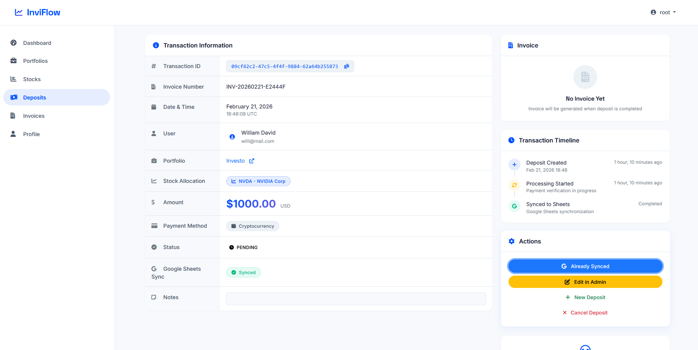
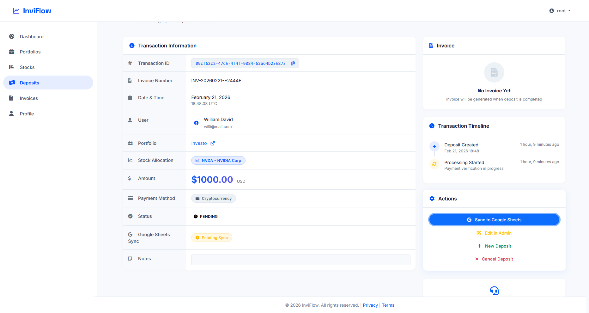
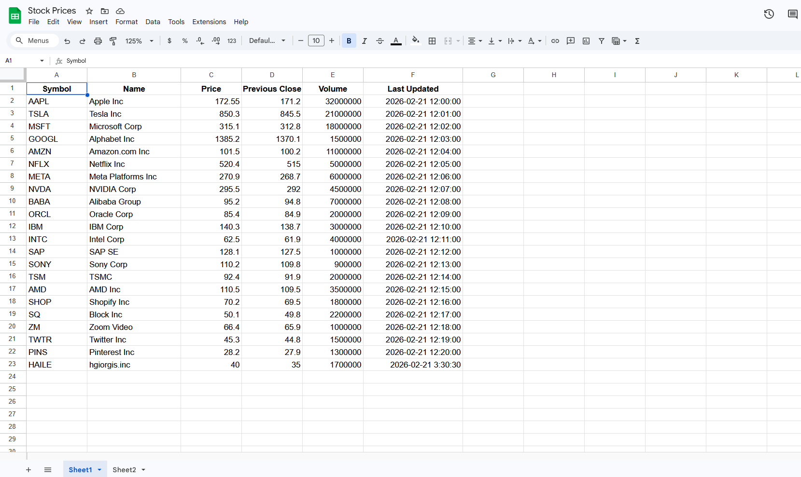
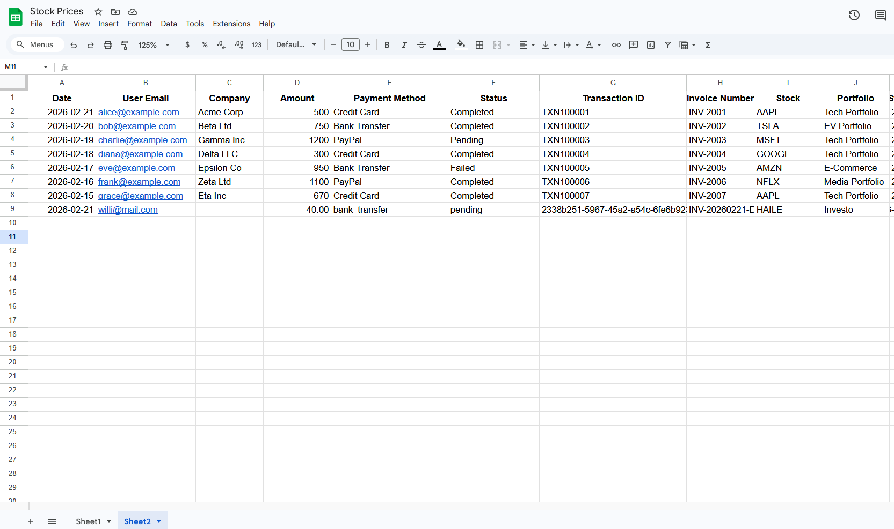

# 📘 **InviFlow - Investment Portfolio Platform**

## 🚀 **Overview**

**InviFlow** transforms Google Sheets into a powerful investment portfolio platform with automatic PDF invoice generation. It demonstrates real-world two-way data synchronization between Django and Google Sheets API, creating a complete financial management system.

[](https://www.djangoproject.com/)
[](https://www.python.org/)
[](https://developers.google.com/sheets/api)
[](https://www.docker.com/)
[](LICENSE)
[](https://github.com/HGiorgis/inviflow/pulls)

<p align="center">
  
</p>

## 🎯 **Complete Setup Guide**

🔗 **GitHub**: [https://github.com/HGiorgis/inviflow.git](https://github.com/HGiorgis/inviflow.git)

---

## ✨ **Features**

| Feature                     | Description                                        |
| --------------------------- | -------------------------------------------------- |
| **📊 Google Sheets Sync**   | Two-way data sync between Django and Google Sheets |
| **📄 Auto PDF Invoices**    | Professional invoices generated automatically      |
| **💼 Portfolio Management** | Track investments with real-time P&L               |
| **📈 Live Stock Data**      | 20+ stocks with price charts                       |
| **👥 User System**          | Registration, login, profiles                      |
| **🐳 Docker Ready**         | Containerized deployment                           |
| **⏰ Task Automation**      | Celery for background jobs                         |
| **🔒 Secure**               | Best practices for authentication                  |

---

## 📸 **Screenshots**

### **Stock Management**

|                              Stock List View                              |                            Stock Detail View                             |
| :-----------------------------------------------------------------------: | :----------------------------------------------------------------------: |
|  |  |
|             Browse all available stocks with real-time prices             |             View detailed stock information and price charts             |

### **Deposit & Invoice System**

|                                Deposit Detail                                |                                Deposit Synced                                |
| :--------------------------------------------------------------------------: | :--------------------------------------------------------------------------: |
|  |  |
|                   Make deposits and generate PDF invoices                    |                       View synchronized deposit status                       |

|                           Deposit Sync Process                           |
| :----------------------------------------------------------------------: |
|  |
|               Real-time synchronization with Google Sheets               |

### **Google Sheets Integration**

|                                      Stocks Sheet                                       |                                       Deposits Sheet                                        |
| :-------------------------------------------------------------------------------------: | :-----------------------------------------------------------------------------------------: |
|  |  |
|                               Two-way sync for stock data                               |                      Automatic deposit tracking and invoice generation                      |

---

## 🛠️ **Tech Stack**

| Category           | Technologies                             |
| ------------------ | ---------------------------------------- |
| **Backend**        | Django 5.2.11, Python 3.11+              |
| **Database**       | SQLite (dev), PostgreSQL (prod)          |
| **External API**   | Google Sheets API, gspread, oauth2client |
| **PDF Generation** | ReportLab 4.4.10                         |
| **Task Queue**     | Celery 5.6.2, Redis 7.2.0                |
| **Frontend**       | Bootstrap 5, Chart.js                    |
| **Container**      | Docker, Docker Compose                   |
| **DevOps**         | Git, Environment Variables               |

---

## ✅ **Prerequisites**

Before starting, ensure you have:

- [ ] **Python 3.11+** installed (`python --version`)
- [ ] **Git** installed (`git --version`)
- [ ] **Google Account** (for Sheets API)
- [ ] **Optional:** Docker & Docker Compose
- [ ] **Optional:** Redis (for Celery)
- [ ] **Optional:** PostgreSQL (for production)

---

## ⚡ **Quick Start (5 Minutes)**

Get running immediately with SQLite (no Google Sheets):

```bash
# 1. Clone repository
git clone https://github.com/HGiorgis/inviflow.git
cd inviflow

# 2. Create virtual environment
python -m venv venv

# Windows
venv\Scripts\activate
# macOS/Linux
source venv/bin/activate

# 3. Install dependencies
pip install -r requirements.txt

# 4. Run migrations
python manage.py migrate

# 5. Create superuser
python manage.py createsuperuser

# 6. Load sample stocks
python manage.py shell -c "from apps.core.models import Stock; stocks=[Stock(symbol='AAPL',name='Apple Inc.',current_price=175.50),Stock(symbol='GOOGL',name='Alphabet Inc.',current_price=140.25),Stock(symbol='MSFT',name='Microsoft Corp.',current_price=380.75)]; [s.save() for s in stocks]; print(f'Created {len(stocks)} stocks')"

# 7. Run server
python manage.py runserver
```

**Your app is now running at:** http://127.0.0.1:8000/ 🎉

---

## 📥 **Detailed Installation**

### **Step 1: Clone Repository**

```bash
git clone https://github.com/HGiorgis/inviflow.git
cd inviflow
```

### **Step 2: Virtual Environment**

**Windows (Command Prompt):**

```bash
python -m venv venv
venv\Scripts\activate
```

**Windows (PowerShell):**

```bash
python -m venv venv
.\venv\Scripts\Activate.ps1
```

**macOS/Linux:**

```bash
python3 -m venv venv
source venv/bin/activate
```

_Verify activation:_ Your prompt should show `(venv)`

### **Step 3: Install Dependencies**

```bash
pip install --upgrade pip
pip install -r requirements.txt
```

**If you encounter errors:**

```bash
# For psycopg2 issues (use SQLite instead)
pip install -r requirements.txt --no-deps
pip install Django reportlab gspread oauth2client python-decouple
```

### **Step 4: Environment Configuration**

Create `.env` file:

```bash
cp .env.example .env
```

Generate a secret key:

```bash
python -c "from django.core.management.utils import get_random_secret_key; print(get_random_secret_key())"
```

Edit `.env` with your values:

```env
# Django (REQUIRED)
SECRET_KEY=your-generated-secret-key-here
DEBUG=True
ALLOWED_HOSTS=localhost,127.0.0.1

# Database (SQLite default - no changes needed)
DB_NAME=inviflow
DB_USER=postgres
DB_PASSWORD=postgres
DB_HOST=localhost
DB_PORT=5432

# Google Sheets (for full functionality)
GOOGLE_SHEETS_CREDENTIALS=credentials.json
GOOGLE_SHEETS_ID=your-google-sheet-id-here

# Redis (optional - for Celery)
REDIS_URL=redis://localhost:6379
```

### **Step 5: Database Setup**

**For SQLite (Default - No Setup Needed)**

**For PostgreSQL (Optional):**

```bash
# Install PostgreSQL, then:
createdb inviflow
# Update .env with your credentials
```

### **Step 6: Run Migrations**

```bash
python manage.py makemigrations core portfolio payments
python manage.py migrate
```

### **Step 7: Create Superuser**

```bash
python manage.py createsuperuser
```

Follow prompts to create admin user.

### **Step 8: Load Initial Data**

**Option A: Quick script**

```bash
python scripts/init_db.py
```

**Option B: Manual**

```bash
python manage.py shell
```

```python
from apps.core.models import Stock

stocks_data = [
    {'symbol': 'AAPL', 'name': 'Apple Inc.', 'price': 175.50},
    {'symbol': 'GOOGL', 'name': 'Alphabet Inc.', 'price': 140.25},
    {'symbol': 'MSFT', 'name': 'Microsoft Corp.', 'price': 380.75},
    {'symbol': 'AMZN', 'name': 'Amazon.com Inc.', 'price': 145.80},
    {'symbol': 'TSLA', 'name': 'Tesla Inc.', 'price': 240.50},
    {'symbol': 'META', 'name': 'Meta Platforms Inc.', 'price': 330.20},
    {'symbol': 'NVDA', 'name': 'NVIDIA Corp.', 'price': 480.90},
]

for data in stocks_data:
    Stock.objects.create(
        symbol=data['symbol'],
        name=data['name'],
        current_price=data['price']
    )
    print(f"Created {data['symbol']}")

exit()
```

---

## 🔑 **Google Sheets Setup (CRUCIAL for Full Functionality)**

### **Step 1: Create Google Cloud Project**

1. Go to [Google Cloud Console](https://console.cloud.google.com/)
2. Click **Select Project** → **New Project**
3. Name: `inviflow` (or any name)
4. Click **Create**

### **Step 2: Enable Google Sheets API**

1. In your project, go to **APIs & Services** → **Library**
2. Search for **Google Sheets API**
3. Click **Enable**

### **Step 3: Create Service Account**

1. Go to **APIs & Services** → **Credentials**
2. Click **Create Credentials** → **Service Account**
3. Name: `inviflow-service-account`
4. Role: **Editor** (or at minimum, enable Sheets API)
5. Click **Done**

### **Step 4: Generate JSON Key**

1. In service accounts list, click your new account
2. Go to **Keys** tab
3. Click **Add Key** → **Create New Key**
4. Choose **JSON** format
5. **Download** the file
6. **Rename** to `credentials.json`
7. **Place** in project root directory

### **Step 5: Find Your Client Email**

Open `credentials.json` and find:

```json
"client_email": "inviflow-service-account@your-project.iam.gserviceaccount.com"
```

Copy this email.

### **Step 6: Create Google Sheets**

Create two worksheets in Google Sheets:

**Sheet 1: Name it "Stocks"** (see screenshot below)


```
| Symbol | Name           | Price | Previous Close | Volume   | Last Updated          |
|--------|----------------|-------|----------------|----------|----------------------|
| AAPL   | Apple Inc      | 172.55| 171.2          | 32000000 | 2026-02-21 12:00:00 |
| TSLA   | Tesla Inc      | 850.3 | 845.5          | 21000000 | 2026-02-21 12:01:00 |
| MSFT   | Microsoft Corp | 315.1 | 312.8          | 18000000 | 2026-02-21 12:02:00 |
```

**Sheet 2: Name it "Deposits"** (see screenshot below)


```
| Date       | User Email        | Company   | Amount | Payment Method | Status    | Transaction ID | Invoice Number | Stock | Portfolio       | Sync Timestamp        |
|------------|-------------------|-----------|--------|----------------|-----------|----------------|----------------|-------|-----------------|----------------------|
| 2026-02-21 | user@example.com  | Acme Corp | 500    | Credit Card    | Completed | TXN100001      | INV-2001       | AAPL  | Tech Portfolio  | 2026-02-21 12:00:00 |
```

### **Step 7: Share Sheets with Service Account**

1. Click **Share** button in each sheet
2. Paste the `client_email` from credentials.json
3. Set permission to **Editor**
4. Click **Send**

### **Step 8: Get Sheet ID**

From your sheet URL:

```
https://docs.google.com/spreadsheets/d/THIS-PART-IS-YOUR-SHEET-ID/edit
```

Copy the ID and add to `.env`:

```env
GOOGLE_SHEETS_ID=your-actual-sheet-id-here
```

### **Step 9: Test the Connection**

```bash
python manage.py shell
```

```python
from apps.core.utils.google_sheets import GoogleSheetsClient
client = GoogleSheetsClient()
print(f"✅ Connected to sheet: {client.sheet.title}")
data = client.get_stock_prices()
print(f"✅ Found {len(data)} stocks")
exit()
```

---

## 🏃 **Running the Application**

### **Development Server (Basic)**

```bash
python manage.py runserver
```

Access: http://127.0.0.1:8000/

### **With Celery (Background Tasks)**

**Terminal 1 - Django:**

```bash
python manage.py runserver
```

**Terminal 2 - Redis (if local):**

```bash
# Windows: Download from https://github.com/microsoftarchive/redis/releases
redis-server

# Or use Docker
docker run -d -p 6379:6379 redis
```

**Terminal 3 - Celery Worker:**

```bash
celery -A inviflow worker --loglevel=info
```

**Terminal 4 - Celery Beat (Scheduler):**

```bash
celery -A inviflow beat --loglevel=info
```

### **With Docker (Full Stack)**

```bash
# Build and start
docker-compose up -d --build

# Run migrations
docker-compose exec web python manage.py migrate

# Create superuser
docker-compose exec web python manage.py createsuperuser

# Load data
docker-compose exec web python scripts/init_db.py

# View logs
docker-compose logs -f

# Stop
docker-compose down
```

Access: http://localhost:8000/

---

## 🧪 **Testing the System**

### **Test 1: Verify Installation**

```bash
python manage.py check
python manage.py runserver
```

Visit http://127.0.0.1:8000/ - You should see the homepage.

---

## 🚦 **Quick Command Reference**

| Task                  | Command                                           |
| --------------------- | ------------------------------------------------- |
| **Setup**             | `python -m venv venv && source venv/bin/activate` |
| **Install**           | `pip install -r requirements.txt`                 |
| **Migrations**        | `python manage.py migrate`                        |
| **Superuser**         | `python manage.py createsuperuser`                |
| **Run Server**        | `python manage.py runserver`                      |
| **Shell**             | `python manage.py shell`                          |
| **Sync Sheets**       | `python manage.py sync_google_sheets`             |
| **Generate Invoices** | `python manage.py generate_invoices`              |
| **Celery Worker**     | `celery -A inviflow worker -l info`               |
| **Celery Beat**       | `celery -A inviflow beat -l info`                 |
| **Docker Build**      | `docker-compose up -d --build`                    |
| **Docker Logs**       | `docker-compose logs -f`                          |
| **Docker Down**       | `docker-compose down`                             |

---

## 🎯 **What's Next?**

After setup, you can:

- [ ] **Explore** the admin interface at `/admin`
- [ ] **Create** multiple portfolios
- [ ] **Add** stocks to portfolios
- [ ] **Make** deposits and download invoices (see deposit screenshots above)
- [ ] **View** stock details with price charts (see stock detail screenshot)
- [ ] **Set up** Google Sheets for full functionality
- [ ] **Configure** Celery for automation
- [ ] **Deploy** to production (Render, Heroku, AWS)

---

## 📄 **License**

MIT License - see [LICENSE](LICENSE) file.

---

## 📞 **Contact & Support**

**Hailegiorgis Wagaye**

- GitHub: [@HGiorgis](https://github.com/HGiorgis)
- Email: hailegiorgis333@gmail.com
- Project Link: [https://github.com/HGiorgis/inviflow](https://github.com/HGiorgis/inviflow)

---

<p align="center">
  <b>⭐ Star this repository if you find it useful! ⭐</b>
  <br>
  Made with ❤️ using Django and Google Sheets API
  <br>
  
  <br>
  © 2026 InviFlow
</p>
